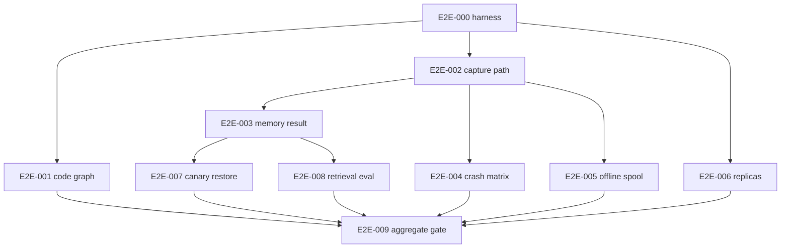

# Agent Context Cross-Repository Integration Plan

> **For agentic workers:** REQUIRED SUB-SKILL: Use superpowers:subagent-driven-development (recommended) or superpowers:executing-plans to implement this plan task-by-task. Steps use checkbox (`- [ ]`) syntax for tracking.

**Goal:** Prove the four released repositories behave as one recoverable Codex-first memory platform under duplicates, crashes, offline operation, replica changes and secret canaries.

**Architecture:** The integration harness lives in `agent-context-infra/integration` and consumes only immutable SDK packages and application/container releases. Each scenario owns a separate directory and Compose project, so independent agents can implement scenarios in parallel worktrees. Scenarios may observe public APIs and datastores but may not import application internals or add product features.

**Tech Stack:** Docker Compose, Python 3.12, uv, pytest, testcontainers/HTTP clients, Bats, jq, Git fixtures, pinned Codex CLI, MCP conformance suite and canary scanner.

## Global constraints

- Integration code belongs to `agent-context-infra`; no fifth repository is created.
- Every run consumes exact entries from `integration/fixtures/versions-under-test.lock` and records resolved digests.
- Scenarios use distinct Compose project names `agent_context_e2e_001` through `agent_context_e2e_008` and distinct temporary roots under `/tmp/agent-context-e2e`.
- A scenario owns only `integration/scenarios/e2e_NNN`; E2E-009 alone edits the root scenario registry and aggregate runner.
- Fixture time, UUID source, Git author/committer and random seed are fixed where deterministic output is required.
- Secret canaries are generated at runtime from non-secret fragments, never committed as realistic credentials.
- Tests never read Codex transcript files or hidden reasoning.
- Tests invoke public CLIs, HTTP/MCP endpoints, PostgreSQL read-only verification queries and S3/Neo4j administrative test credentials only.
- No expected-failure baseline may waive ledger integrity, redaction, missing-object, MCP-required conformance or restore failures.
- Scenario cleanup resolves and validates the exact Compose project/root first. Failed scenarios preserve their workspace and print its path.
- Results are content-sanitized JUnit, JSON metrics and signed manifests; raw prompts/tool bodies are not CI artifacts.

---

## Dependency graph



E2E-001 and E2E-002 may run together after their component gates. E2E-004, E2E-005 and E2E-006 are independent after their stated dependencies. E2E-007 and E2E-008 may run together after E2E-003. E2E-009 is the sole integration owner.

## File map

```text
agent-context-infra/integration/
├── pyproject.toml
├── uv.lock
├── compose.yml
├── run.py
├── harness/
│   ├── artifacts.py
│   ├── canaries.py
│   ├── compose.py
│   ├── fixtures.py
│   ├── probes.py
│   └── versions.py
├── fixtures/
│   ├── repository-builder/
│   ├── graph-golden.json
│   ├── codex/
│   ├── retrieval/
│   └── versions-under-test.lock
├── scenarios/
│   ├── e2e_001_code_graph/
│   ├── e2e_002_capture_path/
│   ├── e2e_003_memory_result/
│   ├── e2e_004_failure_matrix/
│   ├── e2e_005_offline_spool/
│   ├── e2e_006_replicas/
│   ├── e2e_007_canary_restore/
│   └── e2e_008_retrieval_eval/
└── reports/
```

## Task E2E-000: Integration harness and deterministic fixtures

**Depends on:** INFRA-001 and SDK G1.

**Files:** Root integration files, `harness/`, `fixtures/repository-builder/`, `fixtures/versions-under-test.lock`, `tests/test_harness.py`.

**Interfaces:** Produces `ScenarioContext`, exact-version resolver, isolated Compose lifecycle, fake clock, canary factory and sanitized artifact writer.

- [ ] Write tests rejecting floating image tags, missing Git/package digests, reused Compose project names, roots outside `/tmp/agent-context-e2e` and cleanup targeting the live stack.
- [ ] Define `versions-under-test.lock` schema with SDK wheel SHA-256; platform/Codex/infra commit SHAs; platform image digest; Codex CLI version; PostgreSQL/Garage/Neo4j digests; MCP conformance version.
- [ ] Implement fixture-repository builder with fixed author `Agent Context Fixture`, UTC timestamps and deterministic commit sequence.
- [ ] Create three modules/files: Python `orders.service`, TypeScript `web.cart`, Go `cmd.api`; define exactly ten symbols and three call/reference relations in the golden manifest.
- [ ] Add a second commit renaming `web/cart.ts` to `web/basket.ts`, then a dirty workspace change introducing one uncommitted symbol. Record intended logical identity and revision transitions.
- [ ] Run the builder twice in fresh directories and assert identical Git commit IDs/content digests.
- [ ] Generate canaries at runtime for token, private key, credential URL and structured secret field; artifact writing rejects any generated value.
- [ ] Commit `test: scaffold isolated integration harness`.

## Task E2E-001: Repository to exact temporal code graph

**Depends on:** E2E-000 and G3.

**Files:** `integration/scenarios/e2e_001_code_graph/test_scenario.py`, `scenario.json`, `README.md`.

**Interfaces:** Exercises platform scan/index/project/rebuild CLIs and graph read API.

- [ ] Start canonical stores and platform from the lock, build the fixture repository and register its exact local checkout.
- [ ] Index the first commit; assert three module nodes, three file revisions, ten symbol revisions and the exact golden definitions/references/calls.
- [ ] Index the rename commit; assert file logical identity remains stable, prior revision closes validity and new path revision opens at the new commit.
- [ ] Index the dirty snapshot; assert base commit, patch digest, modified-content digest and uncommitted symbol revision link to `WorkspaceSnapshot` rather than pretending to be a commit.
- [ ] Assert SCIP evidence outranks Tree-sitter where both exist; Tree-sitter-only relations are labeled heuristic with extractor version/confidence.
- [ ] Reindex unchanged input and assert zero new canonical code events/revisions.
- [ ] Empty Neo4j, replay from PostgreSQL/object store and compare exact graph digest/golden manifest.
- [ ] Commit `test: prove reconstructible temporal code graph`.

## Task E2E-002: Codex hook through redaction, spool and projection

**Depends on:** E2E-000, G2 and G3.

**Files:** `integration/scenarios/e2e_002_capture_path/test_scenario.py`, `fixtures.py`, `scenario.json`, `README.md`.

**Interfaces:** Exercises `agent-context-codex capture-hook`, uploader, ingestion API, PostgreSQL, S3 and projectors.

- [ ] Invoke documented SessionStart, UserPromptSubmit, PostToolUse and SessionEnd fixtures containing runtime canaries and a dirty fixture worktree.
- [ ] Stop the network during capture; assert Codex commands exit successfully and sanitized rows enter the protected spool.
- [ ] Start platform/uploader and await projection checkpoint equal to the accepted event set.
- [ ] Assert one session, one turn, one tool call/result and one workspace snapshot with exact causal/native IDs.
- [ ] Assert complete public non-secret text survives byte-for-byte after retrieval, while each canary becomes the typed ordinal redaction token and reports the detector count.
- [ ] Scan SQLite/WAL/SHM, captured HTTP, PostgreSQL text/bytea, S3 decompressed objects, Neo4j properties and logs for zero original canaries.
- [ ] Commit `test: trace sanitized Codex capture end to end`.

## Task E2E-003: Session to grounded `context_for_task`

**Depends on:** E2E-002 and G4.

**Files:** `integration/scenarios/e2e_003_memory_result/test_scenario.py`, `expected-package.json`, `scenario.json`, `README.md`.

**Interfaces:** Calls the public stateless MCP endpoint and validates SDK `ContextPackageV1`.

- [ ] Seed the code graph plus a recorded decision, failed test and successful correction through the capture path.
- [ ] Call `context_for_task` for the fixture task at the dirty snapshot and at the prior committed revision.
- [ ] Assert exact relevant repository/module/file/symbol, decision and failure items; each item must cite canonical event/content/revision evidence.
- [ ] Assert `as_of_event_id`, projection checkpoint, staleness, scope, budget/truncation and signed cursor semantics.
- [ ] Assert the prior-revision query excludes future dirty-snapshot facts and later correction.
- [ ] Insert hostile instruction text into a source comment; assert it is returned only as quoted untrusted evidence and never changes tool/result control fields.
- [ ] Commit `test: verify grounded task memory package`.

## Task E2E-004: Duplicate, crash, replay and integrity matrix

**Depends on:** E2E-002.

**Files:** `integration/scenarios/e2e_004_failure_matrix/test_matrix.py`, `faults.py`, `scenario.json`, `README.md`.

**Interfaces:** Uses documented fault-injection labels exposed only in test images.

- [ ] Submit 100 concurrent identical batches; assert one canonical event/content set and one projection effect.
- [ ] Crash at: before S3 put, after put, after head verification, before DB transaction, after event before outbox statement, before commit, after commit before HTTP response, after response before spool ack, during projection mutation and before projector checkpoint.
- [ ] For each cut point, restart/retry and assert no committed reference to a missing object, no duplicate sequence, contiguous per-stream hash chain and eventual projection convergence.
- [ ] Corrupt an unreferenced object and assert the sweeper removes it only after cutoff; corrupt referenced metadata and assert integrity alarm without automatic destructive repair.
- [ ] Reorder two causally related deliveries and assert bi-temporal `occurred_at`/`observed_at` query correctness.
- [ ] Replay all projectors into empty Neo4j twice and compare graph digest/checkpoint.
- [ ] Commit `test: exercise canonical failure boundaries`.

## Task E2E-005: Seven-day-equivalent offline spool and recovery

**Depends on:** E2E-002.

**Files:** `integration/scenarios/e2e_005_offline_spool/test_scenario.py`, `load.py`, `scenario.json`, `README.md`.

**Interfaces:** Uses adapter fake clock and configurable low byte ceiling to simulate seven days without wall-clock waiting.

- [ ] Generate the approved daily mix of sessions, prompts, tool calls and results for seven logical days while platform is unreachable.
- [ ] Fill beyond the scaled 2 GiB-equivalent limit; assert oldest unpinned detailed content is discarded first and each pressure action leaves one metadata-only event.
- [ ] Restart the adapter process between days and during active leases; assert expired lease recovery and no SQLite corruption.
- [ ] Recover network and drain with bounded batches/backoff while continuing to add fresh events; assert no starvation.
- [ ] Compare accepted idempotency keys with retained spool inputs and pressure reports; every retained event is represented once canonically.
- [ ] Scan the spool and platform for canaries and commit `test: prove offline capture recovery`.

## Task E2E-006: Stateless MCP replicas and restart

**Depends on:** E2E-000, G4 and INFRA-042.

**Files:** `integration/scenarios/e2e_006_replicas/test_scenario.py`, `raw_client.py`, `scenario.json`, `README.md`.

**Interfaces:** Uses a fresh stateless MCP HTTP client per call and Nginx diagnostic replica ID.

- [ ] Call `tools/list`/one tool directly without `server/discover`; assert MCP `2026-07-28` headers/body and success.
- [ ] Call optional `server/discover`, walk pagination and validate `resultType`, `ttlMs` and `cacheScope`.
- [ ] Alternate at least 20 calls until both replica IDs occur; persist no cookies, connection affinity or application session identifier.
- [ ] Restart each replica between calls and assert the next independent call succeeds.
- [ ] Search source/config/traffic for forbidden application dependency on `initialize`, `notifications/initialized`, `Mcp-Session-Id` or sticky directives.
- [ ] Run pinned conformance requirements `2026-07-28` with zero required waiver.
- [ ] Commit `test: verify serverless-style MCP scaling`.

## Task E2E-007: Canary scan across live and restored data

**Depends on:** E2E-003 and INFRA-053.

**Files:** `integration/scenarios/e2e_007_canary_restore/test_scenario.py`, `scanners.py`, `scenario.json`, `README.md`.

**Interfaces:** Scans adapter, network capture, canonical stores, projections, telemetry, backup sets and isolated restore.

- [ ] Inject each runtime canary through hook prompt, tool input/output, JSONL message, source file, Git remote credential URL and exception field.
- [ ] Confirm redaction reports contain typed counts/HMAC labels but no original or unsalted digest.
- [ ] Scan live spool/WAL/SHM/logs, HTTP traces, PostgreSQL, decompressed S3 objects, Neo4j, Prometheus/OTel/Grafana storage and diagnostic artifacts.
- [ ] Run canonical backup and isolated restore/rebuild, then repeat the full scan over backup files and restored services.
- [ ] Fail immediately on one occurrence and preserve only a safe location/type fingerprint, not the matched secret.
- [ ] Commit `test: enforce zero secret canaries after restore`.

## Task E2E-008: Thirty-query retrieval evaluation baseline

**Depends on:** E2E-003.

**Files:** `integration/scenarios/e2e_008_retrieval_eval/test_eval.py`, `cases/*.json`, `scoring.py`, `scenario.json`, `README.md`.

**Interfaces:** Evaluates all five tools against fixed evidence/revision requirements.

- [ ] Author exactly 30 cases: six task context, six repository overview, six symbol context, six decision history and six failure history.
- [ ] Each case specifies scope/as-of, required evidence IDs, forbidden future/unsupported claims, maximum items/bytes/token estimate and maximum staleness.
- [ ] Score deterministic retrieval assertions only: required evidence recall, unsupported claim count, temporal leakage, provenance completeness and budget compliance.
- [ ] Require 100% provenance/budget compliance, zero unsupported claims/temporal leaks and at least 90% required-evidence recall overall with no tool below 80%.
- [ ] Run twice after empty-graph replay; assert identical item/evidence ordering and signed cursor behavior.
- [ ] Record latency distribution and require warm p95 at or below two seconds on the approved homelab profile.
- [ ] Commit `test: baseline grounded memory retrieval`.

## Task E2E-009: Aggregate integration gate

**Depends on:** E2E-001 through E2E-008.

**Files:** `integration/run.py`, `integration/scenarios/registry.py`, `integration/README.md`, `.github/workflows/integration.yml`, `scripts/run-integration.sh`.

**Interfaces:** Discovers only the eight literal registered scenario IDs and produces one signed release-candidate report.

- [ ] Integrate scenario commits in numeric order, resolve only root lock/registry/workflow conflicts and forbid feature code in this task.
- [ ] Run scenarios in dependency-aware parallel groups: `{001,002,006}`, then `{003,004,005}`, then `{007,008}`.
- [ ] Bound concurrency to avoid invalid homelab contention and give each scenario isolated ports/networks/roots.
- [ ] Aggregate exact component digests, pass/fail, canary count, graph digest, chain checkpoint, RPO/RTO and retrieval/latency scores.
- [ ] Sign the report with the release/checkpoint key and make INFRA-060 consume its digest.
- [ ] Commit `test: integrate Agent Context release gates`.

## Aggregate verification

```bash
cd integration
uv sync --frozen
uv run ruff check .
uv run ruff format --check .
uv run mypy harness scenarios
uv run pytest -q
uv run python run.py --versions fixtures/versions-under-test.lock --preserve-on-failure
```

The release candidate passes only when all scenarios succeed, canary count is zero everywhere including restored backups, graph replay is deterministic, event chains/checkpoints verify, MCP required conformance has no waiver, retrieval meets its groundedness thresholds, and measured RPO/RTO/latency satisfy the architecture targets.
