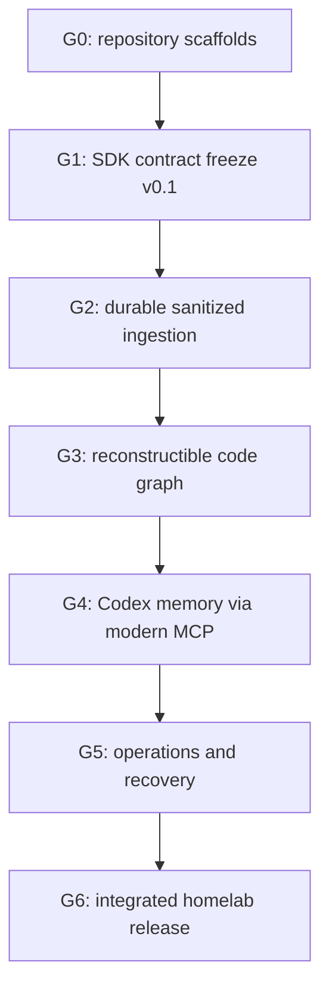

# Agent Context Multi-Repository Implementation Plan

> **For agentic workers:** REQUIRED SUB-SKILL: Use superpowers:subagent-driven-development (recommended) or superpowers:executing-plans to implement this plan task-by-task. Steps use checkbox (`- [ ]`) syntax for tracking.

**Goal:** Deliver the personal/homelab Agent Context platform across four independently versioned repositories, with safe parallel worktrees and a Codex-first vertical slice.

**Architecture:** Freeze canonical contracts in `agent-context-sdk`, then develop durable ingestion, Codex capture and homelab services in parallel. PostgreSQL and sanitized S3 objects are canonical; Neo4j and retrieval indexes are rebuildable projections. A stateless MCP `2026-07-28` endpoint in `agent-context-platform` exposes grounded read-only memory to Codex.

**Tech Stack:** Python 3.12+, uv, Pydantic v2, FastAPI, SQLAlchemy 2, Alembic, PostgreSQL, S3 API/Garage, Neo4j Community, SCIP, Tree-sitter, MCP Python SDK v2, OpenTelemetry, SQLite, Docker Compose, Ansible and Infisical.

## Global Constraints

- Repository names are exactly `agent-context-sdk`, `agent-context-platform`, `agent-context-codex` and `agent-context-infra`.
- Scope is personal/homelab and Codex CLI first.
- Code graph granularity is `repository → module → file → symbol`.
- Complete public content may be stored only after local automatic secret redaction.
- Producer upload and MCP read credentials are distinct and scoped `events:ingest` and `memory:read` respectively.
- Hidden reasoning and unstable Codex transcript formats are never ingested.
- PostgreSQL is the event authority; Neo4j is a disposable projection.
- Large sanitized content uses the S3 API. Garage is the new-install default; MinIO is compatibility-only because its Community repository is unmaintained.
- Delivery is at-least-once with `(producer_id, idempotency_key)` idempotency.
- Event and outbox rows commit in the same PostgreSQL transaction.
- MCP implementation targets `2026-07-28`; no application handshake, `Mcp-Session-Id` or sticky sessions.
- First Codex compatibility floor is CLI `0.147.0`; feature flag use is schema-detected, not permanently assumed.
- Every feature is test-first, makes one reviewable change and ends in a focused commit.
- A task modifies one repository only. Cross-repository changes are separate tasks joined at a gate.

---

## 1. Plan set

| Plan | Scope |
| --- | --- |
| `2026-08-13-agent-context-sdk.md` | Canonical identifiers, events, redaction and DTOs |
| `2026-08-13-agent-context-platform.md` | Ledger, object store, graph, index, retrieval and MCP |
| `2026-08-13-agent-context-codex.md` | Hooks, JSONL, redaction, spool, upload and Codex config |
| `2026-08-13-agent-context-infra.md` | Compose, Garage, private TLS, OTel, backup and restore |
| `2026-08-13-agent-context-integration.md` | Cross-repo E2E, canary, rebuild and homelab release |

The architecture specification is `docs/superpowers/specs/2026-08-13-agent-context-platform-design.md`.

## 2. Worktree operating model

### 2.1 Layout and naming

Use sibling roots so a worktree never nests inside another Git repository:

```text
agent-context-workspace/
├── repos/
│   ├── agent-context-sdk/
│   ├── agent-context-platform/
│   ├── agent-context-codex/
│   └── agent-context-infra/
└── worktrees/
    ├── agent-context-sdk/sdk-013-agent-events/
    ├── agent-context-platform/platform-013-blob-store/
    ├── agent-context-codex/codex-013-spool/
    └── agent-context-infra/infra-010-datastores/
```

Branch name: `agent/<lowercase-task-id>-<slug>`, for example `agent/sdk-013-agent-events`.

Each task card passed to an agent contains:

```yaml
task_id: SDK-013
repository: agent-context-sdk
base_ref_command: git rev-parse refs/tags/contracts-v0.1.0^\{commit\}
allowed_paths:
  - src/agent_context_sdk/events/agent/
  - tests/events/agent/
forbidden_paths:
  - src/agent_context_sdk/__init__.py
  - schemas/
  - uv.lock
consumes:
  - EventEnvelope@SDK-011
produces:
  - SessionStartedV1
  - TurnCompletedV1
verification:
  - uv run pytest tests/events/agent -q
  - uv run mypy src/agent_context_sdk/events/agent
```

The coordinator runs `base_ref_command` immediately before dispatch, records the resulting immutable SHA in the task manifest as `base_ref`, and creates the worktree from that SHA. Before the first contract tag exists, the command is `git rev-parse main`. Agents never choose or infer their own base.

### 2.2 Ownership rules

- One agent owns one bounded directory per wave.
- Only the wave integrator edits package exports, root routers, registries, root Compose, lockfiles and generated artifacts.
- Only one task in a wave writes an Alembic migration.
- Language index adapters register through entry points/functions; they do not concurrently edit a central registry.
- Dependency bumps are isolated PRs.
- Consumers integrate released SDK tags/wheels, never another agent's unmerged SDK branch.

### 2.3 Merge protocol

1. Agent runs the task's targeted tests and returns commit SHA plus verification output.
2. Reviewer checks spec compliance, path ownership and test quality.
3. Integrator rebases/cherry-picks onto the wave integration branch in declared order.
4. Integrator resolves generated files and lockfiles once.
5. Integrator runs the wave gate.
6. Only a passing gate merges to `main` and becomes a valid base for the next wave.
7. Cross-repository consumers use an immutable release/tag/digest produced by the gate.

## 3. Dependency DAG



Infrastructure scaffolding and Codex-local capture can progress ahead of the critical path, but they cannot pass their integration gates until the relevant SDK/API release exists.

## 4. Wave 0 — repository foundations

These four tasks are independent and should run concurrently.

| ID | Repository | Deliverable | Depends on |
| --- | --- | --- | --- |
| SDK-001 | `agent-context-sdk` | Python package, uv, lint, typing, pytest and release workflow | — |
| PLATFORM-001 | `agent-context-platform` | Modular FastAPI package, settings, test app and quality workflow | — |
| CODEX-001 | `agent-context-codex` | Installable CLI package, test entry point and quality workflow | — |
| INFRA-001 | `agent-context-infra` | Compose/Ansible/runbook skeleton and validation workflow | — |

### G0 — Foundation gate

- [ ] The four default branches build from clean clones.
- [ ] `uv run pytest`, Ruff and mypy pass in each Python repository.
- [ ] README files state repository boundaries and point to the approved architecture.
- [ ] Branch/worktree convention and Conventional Commits are documented.
- [ ] No canonical event or DTO has been duplicated outside `agent-context-sdk`.

## 5. Wave 1 — canonical contracts

### 5.1 Serial lane

| ID | Deliverable | Depends on |
| --- | --- | --- |
| SDK-010 | UUIDv7 typed IDs and RFC 8785 canonical serialization | SDK-001 |
| SDK-012 | `ContentRef`, `RedactionReport` and content-disposition contracts | SDK-010 |
| SDK-011 | Event draft/stored envelopes, resolved content, causal metadata, stream integrity and idempotency | SDK-012 |

### 5.2 Parallel fan-out

| ID | Deliverable | Depends on |
| --- | --- | --- |
| SDK-013 | Session, turn, subagent, tool and system event payloads | SDK-011, SDK-012 |
| SDK-014 | Git, workspace snapshot, code, test, CI and knowledge payloads | SDK-011, SDK-012 |
| SDK-015 | Ingestion, query, `ContextPackage` and MCP tool DTOs | SDK-011, SDK-012 |
| SDK-016 | Local redactor, policies and secret-canary corpus | SDK-012 |

All four tasks are independent worktrees. SDK-017 alone integrates their exports.

| ID | Deliverable | Depends on |
| --- | --- | --- |
| SDK-017 | Registry, JSON Schema bundle, fixtures, compatibility report and `v0.1.0` | SDK-013..016 |

### G1 — Contract Freeze v0.1

- [ ] Wheel and sdist build reproducibly.
- [ ] Exported JSON Schemas have stable golden digests.
- [ ] Canonical serialization and event hashes match across fresh processes.
- [ ] Invalid fixtures fail for the intended schema reason.
- [ ] Redaction canaries occur zero times in every sanitized fixture.
- [ ] Backward-compatibility test loads every `1.x` fixture.
- [ ] Tag `v0.1.0` and its commit SHA are recorded for consumers.

## 6. Wave 2 — storage and local capture

After G1, storage and Codex capture split into independent lanes.

### 6.1 Platform lane

| ID | Deliverable | Depends on |
| --- | --- | --- |
| PLATFORM-010 | Settings/DI and exact SDK `v0.1.0` pin | PLATFORM-001, G1 |
| PLATFORM-011 | Catalog models: workspace/project/repository/checkout/content object | PLATFORM-010 |
| PLATFORM-012 | Ledger/outbox/checkpoint/DLQ models | PLATFORM-010 |
| PLATFORM-013 | Product-neutral S3 blob adapter, digest verification and orphan protocol | PLATFORM-010 |
| PLATFORM-014 | Neo4j driver, health check, constraints and indexes | PLATFORM-010 |
| PLATFORM-015 | Single initial migration integrating PLATFORM-011/012 | PLATFORM-011, PLATFORM-012 |

PLATFORM-011..014 run in parallel. PLATFORM-015 is the sole migration owner.

### 6.2 Codex lane

| ID | Deliverable | Depends on |
| --- | --- | --- |
| CODEX-010 | Runtime settings and exact SDK `v0.1.0` pin | CODEX-001, G1 |
| CODEX-011 | Public Codex hook-field mapper | CODEX-010 |
| CODEX-012 | Local redaction boundary and metadata-only fallback | CODEX-010, SDK-016 |
| CODEX-013 | Protected SQLite spool, leases and pressure policy | CODEX-010 |
| CODEX-014 | Public `codex exec --json` event adapter | CODEX-010 |
| CODEX-015 | Git/worktree/workspace-snapshot enrichment | CODEX-010 |

CODEX-011..015 use separate directories and can run concurrently.

### 6.3 Infrastructure lane

| ID | Deliverable | Depends on |
| --- | --- | --- |
| INFRA-010 | PostgreSQL, Neo4j and Garage Compose fragments | INFRA-001 |
| INFRA-011 | Networks, encrypted volumes and Infisical reference templates | INFRA-001 |
| INFRA-012 | Datastore health checks and idempotent bootstrap | INFRA-010, INFRA-011 |

### G2A — Storage/capture component gate

- [ ] Migration applies to empty PostgreSQL and downgrades in the test environment.
- [ ] S3 adapter passes against Garage and a generic S3 contract fixture.
- [ ] Neo4j constraints are idempotent.
- [ ] Every Codex content path invokes redaction before spool I/O.
- [ ] Redactor failure persists allowlisted metadata only.
- [ ] Uncommitted patch digest remains stable for identical workspace state.

## 7. Wave 3 — durable ingestion vertical slice

### 7.1 Platform

| ID | Deliverable | Depends on |
| --- | --- | --- |
| PLATFORM-020 | Concurrent idempotent ledger append and per-stream hash chain | PLATFORM-012, PLATFORM-015 |
| PLATFORM-021 | Inline/large content service with 64 KiB threshold | PLATFORM-011, PLATFORM-013, PLATFORM-015 |
| PLATFORM-022 | Batch ingestion API and atomic ledger/outbox service | PLATFORM-020, PLATFORM-021 |
| PLATFORM-023 | OpenAPI snapshot and consumer contract tests | PLATFORM-022 |
| PLATFORM-024 | Projector runtime, lease, checkpoint, retry and DLQ | PLATFORM-012, PLATFORM-014, PLATFORM-015 |
| PLATFORM-025 | Portfolio/session/turn/tool/Git initial projectors | PLATFORM-024, SDK-013, SDK-014 |

PLATFORM-020 and 021 may run in parallel. PLATFORM-024 can run while the API is developed.

### 7.2 Codex

| ID | Deliverable | Depends on |
| --- | --- | --- |
| CODEX-020 | Hook → redact → enrich → spool pipeline | CODEX-011..013, CODEX-015 |
| CODEX-021 | Batch HTTP client, retry/backoff and acknowledged replay | CODEX-013, SDK-015 |
| CODEX-022 | Idempotent hook installer and trust instructions | CODEX-020 |
| CODEX-023 | JSONL → redact → enrich → spool pipeline | CODEX-012..015 |

PLATFORM-022 and CODEX-021 develop against SDK-015 independently, then integrate only after PLATFORM-023 freezes the HTTP contract.

### G2 — Durable Sanitized Ingestion

- [ ] Concurrent replay of the same batch produces one canonical event set.
- [ ] Ledger/outbox commit is atomic under injected crashes.
- [ ] Large content is present only as a verified sanitized object.
- [ ] No event references a missing object.
- [ ] Hook execution remains fail-open when every remote service is stopped.
- [ ] Spool drains exactly once after services recover.
- [ ] Canary scan is clean in SQLite, captured HTTP, PostgreSQL, S3 objects, Neo4j and logs.

## 8. Wave 4 — code index and temporal graph

| ID | Repository | Deliverable | Depends on |
| --- | --- | --- | --- |
| PLATFORM-030 | platform | Git scanner and incremental file selection | G2 |
| PLATFORM-031 | platform | File/symbol logical identity, revisions, rename and supersession | PLATFORM-030, SDK-014 |
| PLATFORM-032 | platform | Tree-sitter adapter protocol and sandbox runner | PLATFORM-031 |
| PLATFORM-033 | platform | Python structural adapter | PLATFORM-032 |
| PLATFORM-034 | platform | TypeScript/JavaScript structural adapter | PLATFORM-032 |
| PLATFORM-035 | platform | Go structural adapter | PLATFORM-032 |
| PLATFORM-036 | platform | SCIP importer and semantic-identity precedence | PLATFORM-031 |
| PLATFORM-037 | platform | Idempotent code-index event emission | PLATFORM-033..036 |
| PLATFORM-038 | platform | Temporal `repository → module → file → symbol` projector | PLATFORM-024, PLATFORM-037 |
| PLATFORM-039 | platform | Projector registry, verifier and rebuild CLI | PLATFORM-025, PLATFORM-038 |

PLATFORM-033..036 are independent worktrees. PLATFORM-032 defines their interface and PLATFORM-037 is the only registry integrator.

### G3 — Reconstructible Code Graph

- [ ] Golden repository fixture produces exact modules/files/symbols/relations.
- [ ] Unchanged reindex creates no new revision.
- [ ] Git rename keeps logical identity when evidence is deterministic.
- [ ] Dirty workspace snapshot links the session to uncommitted revisions.
- [ ] SCIP wins over Tree-sitter and inference for semantic identity.
- [ ] Every derived edge carries provenance, confidence, extractor version and bi-temporal fields.
- [ ] Rebuild from empty Neo4j produces the same graph digest.

## 9. Wave 5 — context retrieval and modern MCP

### 9.1 Parallel retrieval fan-out

| ID | Deliverable | Depends on |
| --- | --- | --- |
| PLATFORM-040 | Bounded repository/module/file/symbol graph traversal | G3 |
| PLATFORM-041 | Bi-temporal session/decision/failure queries | G3 |
| PLATFORM-042 | Lexical/vector retrieval over sanitized content | PLATFORM-021, G3 |
| PLATFORM-043 | Budgeted `ContextPackage` composer and ranking | PLATFORM-040..042 |

PLATFORM-040..042 are independent.

### 9.2 MCP lane

| ID | Deliverable | Depends on |
| --- | --- | --- |
| PLATFORM-044 | MCP Python SDK v2, `/mcp`, `server/discover`, stateless HTTP | PLATFORM-010, SDK-015 |
| PLATFORM-045 | Read-only bearer authentication, Host/Origin policy and rate limits | PLATFORM-044 |
| PLATFORM-046 | Five approved memory tools backed by PLATFORM-043 | PLATFORM-043..045 |
| PLATFORM-047 | MCP `2026-07-28` unit/integration/conformance suite | PLATFORM-046 |
| PLATFORM-048 | Current-first MCP ADR, profile, security, scale and legacy docs | PLATFORM-047 |

PLATFORM-044 may begin before retrieval; its initial test tool is private to tests and never ships.

### 9.3 Codex integration

| ID | Deliverable | Depends on |
| --- | --- | --- |
| CODEX-040 | Codex version/schema detection and idempotent MCP config install | PLATFORM-044, CODEX-010 |
| CODEX-041 | Real Codex CLI smoke test of all five tools | PLATFORM-046, CODEX-040 |
| CODEX-042 | Compatibility matrix and troubleshooting | CODEX-041 |
| CODEX-043 | Optional local Codex plugin package bundling skill/hooks | CODEX-022, CODEX-042 |

### G4 — Codex Memory

- [ ] Pinned MCP conformance `--requirements 2026-07-28` passes.
- [ ] Direct `tools/list`/tool call works without discovery handshake.
- [ ] `server/discover`, pagination, `resultType`, `ttlMs` and `cacheScope` conform.
- [ ] Application source contains no legacy session/handshake dependency.
- [ ] Two calls routed to different replicas succeed without affinity.
- [ ] Codex `0.147.0` with required flag lists and calls every tool.
- [ ] Missing token and unavailable MCP fail clearly without blocking normal Codex work.
- [ ] Every result has provenance, checkpoint and staleness.

## 10. Wave 6 — observability and resilience

| ID | Repository | Deliverable | Depends on |
| --- | --- | --- | --- |
| PLATFORM-050 | platform | OTel spans/metrics for ingestion, projection, indexing, retrieval and MCP | G4 |
| PLATFORM-051 | platform | Codex OTel normalization and native-ID coalescing | G2 |
| CODEX-050 | codex | Safe Codex OTel configuration generator | PLATFORM-051 |
| INFRA-040 | infra | Pinned platform service image and migrations job | G4, INFRA-012 |
| INFRA-041 | infra | Private NetBird HTTPS ingress and Infisical token injection | INFRA-040 |
| INFRA-042 | infra | Two-replica round-robin scale test | INFRA-041 |
| INFRA-050 | infra | OTel Collector, Prometheus and Grafana | PLATFORM-050, CODEX-050 |
| INFRA-051 | infra | Alerts for spool, DLQ, projection lag, integrity and datastore health | INFRA-050 |
| INFRA-052 | infra | PostgreSQL PITR, S3 copy and Garage metadata backup | INFRA-040 |
| INFRA-053 | infra | Automated isolated restore/rebuild drill | INFRA-052 |

### G5 — Operable Homelab

- [ ] Private endpoint presents valid TLS and rejects public/non-NetBird access.
- [ ] Two replicas operate without sticky sessions.
- [ ] Telemetry has no content duplication or ingestion loop.
- [ ] Alerts fire under synthetic failures.
- [ ] PostgreSQL PITR and S3 restore meet RPO/RTO targets.
- [ ] Neo4j rebuild completes from restored canonical data.

## 11. Wave 7 — integrated release

The integration harness lives in `agent-context-infra/integration`. Each scenario owns a distinct directory and Compose project, so independent scenarios run in parallel worktrees without shared writes. E2E-009 alone edits the root registry/runner and introduces no product feature.

| ID | Deliverable | Depends on |
| --- | --- | --- |
| E2E-000 | Isolated harness, version lock schema and deterministic fixtures | INFRA-001, G1 |
| E2E-001 | Fixture repository → index → exact graph | E2E-000, G3 |
| E2E-002 | Codex hook → redaction → spool → ledger → projection | E2E-000, G2, G3 |
| E2E-003 | Session → `context_for_task` with exact provenance | E2E-002, G4 |
| E2E-004 | Duplicate/crash/replay/hash-chain/full rebuild matrix | E2E-002 |
| E2E-005 | Seven-day-equivalent offline spool and recovery drain | E2E-002 |
| E2E-006 | MCP calls alternating two replicas and restart | E2E-000, G4, INFRA-042 |
| E2E-007 | Canary scan across live data and restored backups | E2E-003, INFRA-053 |
| E2E-008 | Thirty-query retrieval evaluation baseline | E2E-003 |
| E2E-009 | Dependency-aware aggregate suite and signed candidate report | E2E-001..008 |
| INFRA-060 | Immutable `versions.lock`, release notes and homelab deployment | E2E-009 |

Safe fan-out is `{E2E-001, E2E-002, E2E-006}`, then `{E2E-003, E2E-004, E2E-005}`, then `{E2E-007, E2E-008}` as their gates become available.

### G6 — MVP Release

- [ ] All repositories point to immutable SDK/image revisions.
- [ ] No expected-failure baseline masks a required MCP conformance check.
- [ ] Restore drill, graph parity and hash verification pass.
- [ ] Canary count is zero in live and restored layers.
- [ ] Warm MCP p95 is at most two seconds and projection lag p95 at most 30 seconds.
- [ ] Installation, rollback, replay, purge and restore runbooks were executed, not merely reviewed.
- [ ] Release is tagged `v0.1.0` in every repository with exact SHAs in `versions.lock`.

## 12. Merge order

1. Four scaffolds.
2. SDK IDs, envelope/content contracts, parallel domain contracts, SDK release.
3. Consumer SDK pins.
4. Platform data models and Codex capture components in parallel.
5. Single database migration.
6. Ledger/content services before ingestion API.
7. Projector runtime before domain projectors.
8. HTTP contract snapshot before Codex transport integration.
9. Code identity before language adapters; adapters before code projector.
10. Retrieval queries before composer.
11. MCP transport/auth may merge early; public tools merge only after composer.
12. Codex MCP integration after server conformance.
13. Infra consumes only tagged application images.
14. E2E, restore and canary gates before homelab release.

## 13. Coordinator verification commands

Run at each repository root after integrating a wave:

```bash
uv sync --frozen
uv run ruff check .
uv run ruff format --check .
uv run mypy src
uv run pytest -q
```

Platform integration additionally runs:

```bash
uv run alembic upgrade head
uv run pytest -m integration -q
uv run agent-context projection verify
```

MCP gate pins the current released harness version recorded in the platform lockfile; the first approved pin is `0.1.11`:

```bash
npx --yes @modelcontextprotocol/conformance@0.1.11 server \
  --url http://127.0.0.1:8000/mcp \
  --requirements 2026-07-28
```

Infra and release gates run:

```bash
docker compose config --quiet
ansible-lint
docker compose up -d --wait
./scripts/smoke.sh
./scripts/restore-drill.sh
./scripts/scan-canaries.sh
```

## 14. Stop conditions

The coordinator pauses the affected lane when:

- an SDK contract must change after G1;
- two agents need to edit the same owned file;
- a migration or generated schema differs unexpectedly;
- a redaction canary reaches any persistence or telemetry boundary;
- an event can reference a missing blob;
- a projector cannot replay deterministically;
- MCP required conformance needs a baseline waiver;
- a dependency has become unmaintained or changes license incompatibly;
- restore cannot meet the approved RPO/RTO.

Resume only after an ADR/contract release or corrected predecessor task is merged. Do not patch around a failed gate in a consumer worktree.
