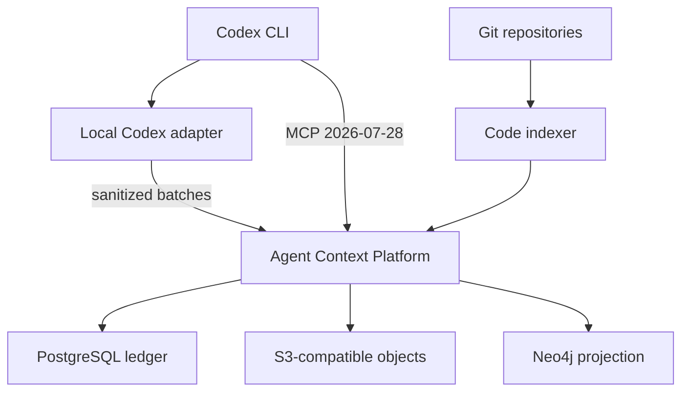
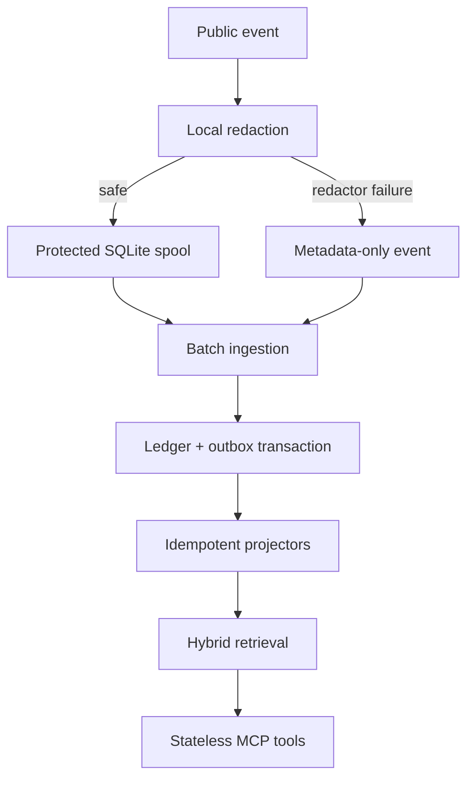
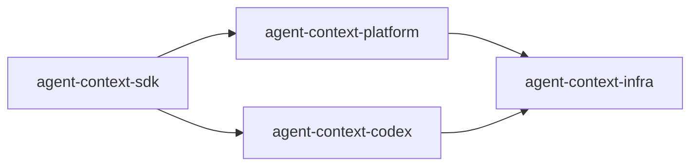

# Agent Context Platform — Architecture Design

**Status:** Approved

**Date:** 2026-08-13

**Scope:** personal/homelab, Codex CLI first, unified agent memory and engineering observability

## 1. Decision summary

Agent Context is a unified platform that records sanitized evidence from code repositories and coding-agent activity, reconstructs a temporal code-and-work graph, and exposes grounded memory directly inside Codex.

The architecture uses:

- PostgreSQL as the authoritative append-only event ledger and operational catalog;
- an S3-compatible object store for large sanitized content;
- Neo4j Community as a disposable temporal graph projection;
- SCIP as the preferred semantic code index and Tree-sitter as the structural fallback;
- Codex lifecycle hooks, public JSONL output and OpenTelemetry as capture surfaces;
- MCP `2026-07-28` over stateless Streamable HTTP as the memory interface;
- four repositories: `agent-context-sdk`, `agent-context-platform`, `agent-context-codex` and `agent-context-infra`.

The central modeling decision is that the system stores **versioned evidence and assertions**, not one mutable notion of current truth. Deterministic evidence outranks inference, every derived fact remains traceable to its source, and every projection can be rebuilt.

## 2. Goals and non-goals

### 2.1 Goals

- Model code at `repository → module → file → symbol` granularity.
- Preserve complete content exposed by public Codex interfaces after local secret redaction.
- Associate sessions, turns, tool calls, worktrees, patches, commits, tests, decisions, failures and artifacts.
- Answer task, repository, symbol, decision and failure-history questions inside Codex.
- Reconstruct the graph from canonical events and sanitized objects.
- Remain useful while Neo4j or the network is unavailable.
- Make ingestion, retrieval, provenance, purge and disaster recovery auditable.
- Permit parallel implementation by agents without duplicating shared contracts.

### 2.2 Non-goals for the MVP

- Multi-tenant SaaS or internet-public operation.
- A custom dashboard.
- Full-language semantic analysis or whole-program CPG ingestion.
- Hidden chain-of-thought collection or parsing private Codex internals.
- Automatic mutation of repositories through MCP.
- Autonomous LLM-generated facts treated as authoritative.
- Neo4j clustering or zero-downtime graph backup.
- GraphRAG community detection and global-summary generation before retrieval evaluations justify them.

## 3. Professional patterns adopted

| Reference | Practice adopted | Boundary in this project |
| --- | --- | --- |
| [SCIP](https://github.com/scip-code/scip) | Language-independent identities, definitions and references | Preferred semantic source; indexer/version/toolchain are recorded |
| [Joern Code Property Graph](https://docs.joern.io/code-property-graph/) | Property-graph representation of program structure | Architectural reference; AST/CFG/data-flow expansion is post-MVP |
| [W3C PROV-O](https://www.w3.org/TR/prov-o/) | Entity, Activity, Agent and derivation semantics | Internal property graph maps to PROV; export can be added later |
| [OpenLineage](https://openlineage.io/docs/spec/object-model/) | Run/job/dataset lifecycle and extensible facets | Used for index, test and CI runs; conversations keep their native model |
| [Microsoft GraphRAG](https://microsoft.github.io/graphrag/) | Graph-grounded hybrid retrieval and hierarchical context | Hybrid retrieval is adopted; costly community summaries are deferred |
| [Graphiti](https://github.com/getzep/graphiti) | Episodes, bi-temporal facts, invalidation and agent context | Temporal semantics are adopted without making Graphiti a core dependency |
| [OpenTelemetry GenAI](https://github.com/open-telemetry/semantic-conventions-genai) | Standard agent, model, retrieval and tool telemetry | Pin a released schema/commit; use `agent_context.*` only for extensions |
| [Transactional outbox](https://docs.aws.amazon.com/prescriptive-guidance/latest/cloud-design-patterns/transactional-outbox.html) | Atomic ledger/outbox write and idempotent consumers | Prevents PostgreSQL/Neo4j dual-write inconsistencies |

These references inform the model; they are not wholesale dependencies. The MVP stays operationally small.

## 4. System context



### 4.1 Runtime flow



No unredacted content crosses the redaction boundary. Hook failure is fail-open for Codex execution but fail-closed for content persistence.

## 5. Repository boundaries

| Repository | Owns | Must not own |
| --- | --- | --- |
| `agent-context-sdk` | IDs, event envelope, domain events, redaction, JSON Schemas, ingestion/query/MCP DTOs and fixtures | Databases, HTTP routes, Codex installation or deployment |
| `agent-context-platform` | FastAPI, ledger, blob adapter, projectors, graph, indexers, retrieval and `/mcp` | Codex-local secret handling or infrastructure inventory |
| `agent-context-codex` | Codex hooks, JSONL adapter, local redaction, protected spool, upload client, config/compatibility checks and optional plugin packaging | Canonical schemas or the remote MCP server |
| `agent-context-infra` | Compose, Ansible/OpenTofu, TLS, private networking, secrets references, OTel, backups, restore and release lock | Domain logic or generated schema definitions |

Contracts flow in one direction:



Consumers pin an immutable SDK release. A feature branch never changes the SDK and a consumer in the same task.

## 6. Canonical event ledger

### 6.1 Envelope

Every event uses this logical shape:

```json
{
  "event_id": "0198a4b1-98c0-7c28-ae3f-2fd03f4db7fd",
  "event_type": "agent.tool_call.completed",
  "schema_version": "1.0.0",
  "stream_id": "session:thr_123",
  "stream_sequence": 42,
  "occurred_at": "2026-08-13T13:01:14.225Z",
  "observed_at": "2026-08-13T13:01:14.311Z",
  "producer": {
    "producer_id": "codex:workstation-1",
    "name": "agent-context-codex",
    "version": "0.1.0"
  },
  "context": {
    "workspace_id": "ws_0198a4a7",
    "project_id": "prj_0198a4a8",
    "repository_id": "repo_0198a4a9",
    "checkout_id": "co_0198a4aa",
    "session_id": "thr_123",
    "turn_id": "turn_456",
    "tool_call_id": "call_789"
  },
  "trace": {
    "trace_id": "4bf92f3577b34da6a3ce929d0e0e4736",
    "span_id": "00f067aa0ba902b7",
    "correlation_id": "corr_0198a4ab",
    "causation_event_id": "0198a4b1-9721-7d09-91ad-b31a5c49b38d"
  },
  "payload": {},
  "content_refs": [],
  "redaction": {
    "policy_version": "1.0.0",
    "disposition": "sanitized",
    "finding_counts": {"credential": 1}
  },
  "integrity": {
    "payload_sha256": "hex",
    "previous_event_sha256": "hex-or-null",
    "event_sha256": "hex"
  },
  "idempotency_key": "hook:thr_123:turn_456:call_789:post"
}
```

Producers submit an `EventDraftV1` containing immutable content claims (producer content ID, media type, size and SHA-256) plus same-batch sanitized content items. The platform verifies each item, resolves every claim to one inline or object-backed `ContentRefV1`, and only then seals the stored envelope shown above. The event-level redaction field is a summary; each content item retains its detailed `RedactionReportV1`.

### 6.2 Invariants

- `event_id` is UUIDv7 and globally unique.
- `(producer_id, idempotency_key)` is unique.
- `stream_sequence` is allocated by the server under a PostgreSQL row lock.
- Timestamps are UTC and RFC 3339 with microsecond precision.
- Hash input uses RFC 8785 JSON Canonicalization Scheme.
- The hash chain is per `stream_id`, never global.
- An event is immutable; corrections and invalidations are new events.
- Schema versions are immutable. Compatible readers use explicitly tested upcasters.
- The ledger and its outbox record commit in one PostgreSQL transaction.
- Delivery is at-least-once; every consumer is idempotent.

A periodic integrity checkpoint signs the current stream heads with a key held outside PostgreSQL. This detects whole-chain rewrites that an internal hash chain alone cannot expose.

### 6.3 Event families

- `agent.session.*`, `agent.turn.*`, `agent.subagent.*`
- `agent.tool_call.*`, `agent.permission.*`, `agent.compaction.*`
- `git.repository.*`, `git.checkout.*`, `git.workspace_snapshot.*`, `git.commit.*`
- `code.index.*`, `code.file.*`, `code.symbol.*`, `code.dependency.*`
- `quality.test_run.*`, `quality.ci_run.*`, `quality.finding.*`
- `knowledge.decision.*`, `knowledge.constraint.*`, `knowledge.failure.*`, `knowledge.summary.*`
- `content.purged`, `projection.rebuilt`, `system.integrity_checked`

## 7. PostgreSQL model

PostgreSQL is the single control-plane and event authority. Referenced sanitized objects are canonical content; Neo4j and search indexes are derived.

| Schema | Principal tables |
| --- | --- |
| `catalog` | `workspaces`, `projects`, `repositories`, `project_repositories`, `checkouts`, `content_objects` |
| `ledger` | `event_streams`, `events`, `redaction_reports`, `event_content_refs`, `integrity_checkpoints` |
| `projection` | `outbox`, `projection_checkpoints`, `ingestion_batches`, `dead_letters` |
| `operations` | `registered_producers`, `schema_versions`, `retention_policies`, `purge_requests` |

The events table is append-only at the database role level: the application role receives `SELECT` and `INSERT`, not `UPDATE` or `DELETE`. Administrative purge removes external content and projections while retaining a tombstoned ledger record and its digest.

Ingestion and memory use separate credentials. A registered Codex producer receives a high-entropy bearer with only `events:ingest`; its non-secret prefix and Argon2id verifier map to exactly one `producer_id`, and every event in the batch must claim that producer. The Codex MCP client receives a different bearer with only `memory:read`. Reuse of one token for both planes is rejected.

## 8. Sanitized object storage

### 8.1 Backend decision

Application code targets a minimal S3-compatible `BlobStore` contract. The initial backend for a new homelab installation is **Garage**, while an existing MinIO endpoint remains supported through the same adapter.

This correction is necessary because the [MinIO Community repository was archived on 2026-04-25 and is no longer maintained](https://github.com/minio/minio). Garage is maintained, lightweight, S3-compatible and designed for small self-hosted deployments ([official project](https://garagehq.deuxfleurs.fr/)). No product-specific administration API is used by the platform.

### 8.2 Object protocol

- Sanitized payloads up to 64 KiB remain inline in PostgreSQL.
- Larger content is Zstandard-compressed and stored at `sha256/aa/bb/<digest>.zst`.
- Object identity is the SHA-256 of the sanitized, uncompressed bytes.
- The default `content_addressed` write mode uses a deterministic PUT and validates the object
  with HEAD. `if_none_match` uses `If-None-Match: *` only for S3 implementations that support
  conditional writes. Garage's S3 API does not provide that conditional-write guarantee, so
  Garage deployments use the default deterministic mode.
- The platform content service uploads the immutable object, reads metadata back and verifies size/digest before ledger commit.
- Ledger event, `content_objects`, reference and outbox commit atomically after verification.
- A failed database transaction may leave a harmless unreferenced object; an orphan sweeper deletes it after 24 hours.
- An event is never acknowledged as complete while a referenced object is missing.
- Bucket policies deny listing and all access except the platform service principal and backup principal.

## 9. Temporal graph projection

### 9.1 Node groups

| Domain | Nodes |
| --- | --- |
| Portfolio | `Workspace`, `Project`, `Repository` |
| Git | `Branch`, `Commit`, `Checkout`, `Worktree`, `WorkspaceSnapshot`, `ChangeSet` |
| Code | `Module`, `File`, `FileRevision`, `Symbol`, `SymbolRevision`, `Dependency` |
| Agent | `AgentRuntime`, `Session`, `Turn`, `ToolCall` |
| Results | `TestRun`, `CIRun`, `Artifact`, `Finding` |
| Knowledge | `Decision`, `Constraint`, `Failure`, `Summary` |

### 9.2 Principal relations

- `(:Project)-[:USES_REPOSITORY]->(:Repository)`
- `(:Repository)-[:CONTAINS_MODULE]->(:Module)`
- `(:Module)-[:CONTAINS_FILE]->(:File)`
- `(:File)-[:HAS_REVISION]->(:FileRevision)`
- `(:FileRevision)-[:DEFINES]->(:SymbolRevision)`
- `(:Symbol)-[:HAS_REVISION]->(:SymbolRevision)`
- `(:SymbolRevision)-[:REFERENCES|CALLS|IMPORTS]->(:SymbolRevision)`
- `(:Session)-[:TARGETED]->(:Checkout)`
- `(:Session)-[:HAS_TURN]->(:Turn)`
- `(:Turn)-[:INVOKED]->(:ToolCall)`
- `(:Session)-[:PRODUCED]->(:WorkspaceSnapshot|ChangeSet|Commit)`
- `(:ChangeSet)-[:MODIFIES]->(:FileRevision|SymbolRevision)`
- `(:TestRun)-[:VALIDATES]->(:Commit|WorkspaceSnapshot)`
- `(:Decision)-[:AFFECTS]->(:Project|Repository|Module|File|Symbol)`
- `(:Decision)-[:SUPERSEDES]->(:Decision)`
- `(:Failure)-[:OBSERVED_IN]->(:Session|TestRun|CIRun)`

### 9.3 Assertion properties

Every derived relation carries:

- `assertion_id`;
- `source_event_id`;
- `evidence_kind` (`git`, `scip`, `tree_sitter`, `test`, `user`, `agent`, `llm_inference`);
- `extractor_name` and `extractor_version`;
- `confidence` in `[0,1]`;
- `valid_from` and `valid_to` for domain validity;
- `recorded_from` and `recorded_to` for system belief;
- `review_status` (`unreviewed`, `accepted`, `rejected`, `superseded`).

Git, SCIP and test results use confidence `1.0` when their claim is direct. Tree-sitter results are labeled structural/heuristic. LLM inference never silently overwrites deterministic evidence.

### 9.4 Projection guarantees

- No application route writes directly to Neo4j.
- A projector consumes outbox rows, upserts by deterministic IDs and advances a checkpoint.
- Retry is bounded; exhausted events enter a DLQ with the original event ID.
- Projectors can replay from zero into an empty graph.
- Graph unavailability never blocks ledger ingestion.
- Neo4j Community is a single instance. Its offline dump is optional acceleration, not the disaster-recovery authority; clustering and online backup require Enterprise ([Neo4j editions](https://neo4j.com/docs/operations-manual/current/introduction/)).

## 10. Code and worktree indexing

### 10.1 Identity

- Repository: platform UUID plus normalized remote identities; never a local path alone.
- Checkout/worktree: ephemeral identity tied to repository and filesystem root.
- Workspace snapshot: `base_commit`, normalized `dirty_patch_sha256`, untracked-file manifest and modified-content digests.
- File logical ID: repository plus lineage identity; rename detection uses Git similarity and corroborating symbol evidence.
- File revision: content digest plus language and parser configuration.
- Symbol logical ID: SCIP symbol when available; otherwise a deterministic namespace/kind/qualified-name identity.
- Symbol revision: signature and semantic fingerprint; a new revision is created only when that fingerprint changes.

Renames preserve logical identity when evidence is sufficient. Ambiguous moves create `POSSIBLY_SUPERSEDES` rather than fabricating certainty.

### 10.2 Indexing strategy

1. Resolve repository, checkout, commit and dirty workspace snapshot.
2. Use language-native SCIP indexers where available.
3. Import SCIP definitions, references and external-symbol identities.
4. Run Tree-sitter adapters for Python, TypeScript/JavaScript and Go to fill structural gaps.
5. Treat YAML, HCL, Ansible and other infrastructure files as `File` nodes in the MVP; add semantic adapters later.
6. Emit canonical code-index events rather than writing graph nodes directly.

Joern-style CFG and data-flow edges are a later bounded extension, not part of the first index.

## 11. Codex capture

### 11.1 Source precedence

| Source | Use |
| --- | --- |
| Codex hooks | Prompts, lifecycle, tool input/result, IDs and last public assistant message |
| `codex exec --json` | Complete public headless event stream |
| Codex OTel | Durations, outcomes, token/transport metadata and correlation |
| Git | Authoritative repository/worktree/patch/commit state |
| SCIP/Tree-sitter | Code structure and semantic evidence |
| Test/CI adapters | Executed behavioral evidence |

Hook and OTel observations sharing native IDs project to the same session/turn/tool entities. Exact duplicate delivery is rejected by idempotency keys.

The adapter must not parse `transcript_path`: official Codex documentation states that transcript format is not a stable hook interface. “Complete content” means complete content exposed through supported public fields; it excludes hidden reasoning.

### 11.2 Local spool

- SQLite database with file mode `0600` on an encrypted user volume.
- Sanitization occurs before opening a write transaction.
- Queue leases permit crash-safe batch upload and replay.
- Default bound: seven days or 2 GiB, whichever is reached first.
- Pressure policy discards oldest non-pinned detailed content only after recording a metadata-only discard event.
- Platform/network failure never blocks the Codex turn.

## 12. Secret redaction and content trust

Redaction is a pure SDK function used before disk, network, logs and spans. It combines:

- structured-field rules;
- known credential/token patterns;
- entropy-based candidates;
- current environment secret values supplied only in memory;
- credential-file and private-key detectors;
- installation-specific allow/deny rules.

Replacement tokens are typed and ordinal within the payload, for example `<redacted:github_token:1>`. If cross-event correlation is needed, the report uses HMAC-SHA-256 with an installation key, never an unsalted hash. The original value is never included in the report.

On redactor exception or uncertainty above policy threshold:

- persist only an allowlisted metadata event;
- set `disposition=dropped_redaction_failure`;
- include detector/policy version and an error class without original content;
- surface a local health warning.

Retrieved repository and session content is untrusted data. MCP results label it as evidence and never convert embedded instructions into system/developer instructions.

## 13. Retrieval and context assembly

Retrieval is hybrid and explainable:

1. Resolve explicit repository/project/revision scope.
2. Traverse deterministic graph neighbors and temporal assertions.
3. Retrieve lexical and vector candidates from sanitized content.
4. Expand candidates through provenance and dependency edges within bounded depth.
5. Rank by evidence strength, scope match, semantic/lexical score, recency and accepted review status.
6. Compose a budgeted `ContextPackage` with citations and staleness information.

Every package contains:

- `schema_version`, `query_id`, `generated_at` and explicit scope;
- `as_of_event_id` and projection checkpoint;
- ranked context items with `source_event_id`, evidence kind, confidence and validity;
- `truncated`, `next_cursor`, warnings and staleness;
- sanitized resource links for evidence too large to inline.

The first evaluation set contains at least 30 golden questions across task context, repository overview, symbol history, decisions and failures. Retrieval features do not graduate without improving grounded-answer quality on this set.

## 14. MCP `2026-07-28` profile

### 14.1 Placement

`agent-context-platform` hosts `/mcp` using the stable MCP Python SDK v2 and Streamable HTTP. `agent-context-codex` only installs/configures the connection and validates client compatibility.

The server is protocol-stateless and serverless-friendly; PostgreSQL, Neo4j, the blob store and ASGI process remain ordinary services.

### 14.2 Normative requirements

- No application implementation of `initialize` or `notifications/initialized`.
- No dependency on `Mcp-Session-Id`, cookies or sticky routing.
- Every request validates `MCP-Protocol-Version`, `Mcp-Method`, applicable `Mcp-Name`, and matching body metadata.
- Protocol version, client identity and client capabilities arrive in request `_meta`.
- Every result supplies server identity metadata and `resultType`.
- `server/discover` is implemented; clients may call a tool without calling it first.
- `tools/list` order and pagination are deterministic and cache metadata uses `ttlMs`/`cacheScope`.
- GET/DELETE and resumable SSE patterns from the previous protocol are not application dependencies.
- Cross-call state uses explicit handles. Read-only MVP tools need none.
- MRTR, Tasks and `subscriptions/listen` are not advertised in the MVP.
- Origin/Host allowlists, request-size limits, timeouts and per-principal rate limits apply before tool execution.
- `traceparent` and allowlisted baggage propagate to OTel.

The Python SDK v2 may accept legacy clients automatically. That compatibility is best-effort SDK behavior; project code and documentation remain `2026-07-28`-first. `stateless_http=True` prevents the compatibility path from requiring sticky state.

### 14.3 Read-only tools

| Tool | Required scope | Purpose |
| --- | --- | --- |
| `context_for_task` | repository ID, commit/workspace snapshot, task text, budget | Assemble grounded context for current work |
| `repository_overview` | repository ID and commit | Summarize modules, dependencies, decisions, failures and recent changes |
| `symbol_context` | repository ID, commit and symbol ID/name | Definition, references, callers/callees and history |
| `decision_history` | project/repository scope, query and valid time | Return active and superseded decisions with evidence |
| `failure_history` | repository scope, query/fingerprint and time range | Connect failures, tests, changes and fixes |

All tools set `readOnlyHint=true`, `destructiveHint=false`, `openWorldHint=false` and provide justifications. They return structured content matching an output schema plus a concise text representation.

### 14.4 Codex compatibility

- Minimum first-tested client: Codex CLI `0.147.0`.
- Enable `features.mcp_2026_07_28=true` only while the running Codex schema supports and requires it.
- Use Streamable HTTP with `bearer_token_env_var`; never place a token in TOML or URL.
- The server is optional/fail-open for ordinary Codex use when unavailable.
- A compatibility command records CLI version, config-schema result, feature-flag state and live smoke-test result without secret values.

### 14.5 Authentication

MVP MCP authentication is a pre-provisioned, high-entropy bearer token with `memory:read`, served over HTTPS and reachable only through the private NetBird network. It is distinct from the producer's `events:ingest` credential. Tokens are stored in Infisical, injected by environment, validated on every request and represented server-side only by strong verifiers.

This is explicitly not described as full MCP OAuth. A later Authentik/OAuth profile must use PKCE, Protected Resource Metadata, issuer/audience/resource validation and Client ID Metadata Documents rather than new Dynamic Client Registration dependencies.

## 15. Observability

- Codex-native OTel export remains a source adapter, not the only audit record.
- Platform spans cover ingestion, blob verification, ledger append, projection, indexing, retrieval and MCP calls.
- Standard OpenTelemetry GenAI attributes are used when defined; extensions use `agent_context.*`.
- Content attributes are disabled by default because sanitized content belongs in the ledger, not duplicated into telemetry.
- Platform self-telemetry is marked with a producer namespace excluded from Codex-ingestion adapters to prevent loops.
- Alerts cover spool pressure, ingestion rejects, outbox/projector lag, DLQ growth, hash-chain failures, missing blobs and retrieval latency.

Initial SLOs on the declared homelab profile:

- warm MCP query p95 at or below two seconds;
- projection lag p95 at or below 30 seconds;
- ingestion availability independent of Neo4j;
- PostgreSQL RPO at or below 15 minutes;
- MCP/PostgreSQL service RTO at or below four hours;
- full Neo4j rebuild RTO at or below 24 hours.

## 16. Retention, purge and correction

Default policies are configurable:

| Class | Default |
| --- | --- |
| Local spool | 7 days or 2 GiB |
| Operational logs/traces | 30 days |
| Full sanitized session content | 180 days |
| Unpinned non-current code indexes | 90 days |
| Metric rollups | 1 year |
| Decisions, constraints and structural provenance | 2 years |
| Pinned sessions/commits/decisions | Until explicit unpin/purge |

A purge request appends a tombstone event, deletes referenced objects when no live reference remains, removes embeddings/search material, invalidates graph projections and expires related caches. The ledger retains non-content metadata and digests so audit continuity remains intact. Backup expiration documents the maximum time until purged content disappears from every recoverable copy.

Corrections append a new assertion and explicitly invalidate or supersede the prior assertion; history is never silently rewritten.

## 17. Backup and disaster recovery

- PostgreSQL: encrypted base backups plus WAL archiving/PITR to an independent target.
- S3 objects: versioned encrypted off-site replication/copy; the only backup cannot live in the same object-store failure domain.
- Garage metadata: scheduled snapshots and backed-up layout/node keys; object data verification is included in restore drills.
- Neo4j: rebuild from ledger and object store; optional offline dump only shortens recovery.
- Git: source, contracts, migrations and infrastructure definitions.
- Secrets/keys: separate encrypted escrow; losing encryption/signing keys makes data backup insufficient.
- Quarterly restore drill verifies manifest checksums, stream hashes, object references, projection parity and redaction canaries.

Recovery order is PostgreSQL, blob store, API/MCP, then Neo4j projection.

## 18. Security model

The threat model includes malicious repositories, symlink/path escape, hostile parser input, persistent prompt injection, memory poisoning, token theft, SSRF, Cypher/SQL injection, unbounded graph queries, compromised indexers and secret propagation.

Required controls:

- rootless, network-disabled indexer containers with read-only checkouts;
- canonical path and symlink validation;
- parameterized SQL/Cypher only; MCP never accepts raw Cypher;
- query depth, node, response-size, CPU and timeout budgets;
- scopes `events:ingest`, `memory:read`, future `memory:write`, `memory:correct` and `admin` kept separate;
- Infisical references instead of secrets in Git or Compose;
- TLS, encrypted volumes and encrypted backups;
- read/write audit records without duplicating returned content;
- canary-secret scanning across spool, transport captures, PostgreSQL, objects, Neo4j, OTel, logs and restored backups.

## 19. Failure semantics

| Failure | Required behavior |
| --- | --- |
| Redactor fails | Metadata-only event; no original content written anywhere |
| Platform/network unavailable | Sanitized local spool; Codex continues |
| PostgreSQL unavailable | No remote acknowledgement; client retries from spool |
| Blob store unavailable for large content | Event remains queued; no dangling ledger reference |
| Neo4j unavailable | Ledger/outbox continue; projector retries and may DLQ |
| Projector bug | Stop affected projector, fix version, replay from checkpoint/zero |
| Hash verification fails | Quarantine stream, alert, block derived projection of affected event |
| MCP unavailable | Codex retains normal coding capability; memory tool reports unavailable |
| MCP replica restarts | Next independent request succeeds on another replica |

## 20. Architecture acceptance criteria

1. One hundred concurrent deliveries of the same batch produce one canonical event set and one projection.
2. Ledger event and outbox are always committed or rolled back together.
3. Crash tests at every object/ledger boundary never create a committed reference to a missing object.
4. Replaying into empty Neo4j reproduces deterministic IDs, relations and digests.
5. Out-of-order evidence produces correct `as_of` and bi-temporal queries.
6. Workspace snapshots preserve uncommitted patches and symbol revisions created by an agent.
7. Renames preserve logical identities when deterministic evidence supports them.
8. Every derived relation exposes evidence, extractor version, confidence and validity.
9. Secret fixtures produce zero canary occurrences across all stores, telemetry, logs and restored backups.
10. SCIP golden fixtures match definitions/references; Tree-sitter-only results are marked heuristic.
11. All five MCP tools return provenance, checkpoint and staleness metadata.
12. Direct tool call without `server/discover` succeeds under MCP `2026-07-28`.
13. Unknown protocol versions and mismatched headers/body return normative errors.
14. Two consecutive calls succeed through different replicas without cookies or affinity.
15. Absent, invalid, expired, revoked and insufficient-scope bearer credentials are rejected without leaking tokens; issuer/audience/resource validation is added with the deferred OAuth profile.
16. Warm MCP p95, projection lag, RPO and RTO meet the initial targets.
17. A quarterly restore reconstructs the graph, verifies chain heads and finds no orphan references.
18. At least 30 retrieval evaluations pass their groundedness and citation assertions.

## 21. Required documentation

### `agent-context-platform`

- `docs/adr/0001-authoritative-ledger-and-rebuildable-graph.md`
- `docs/adr/0002-stateless-mcp-2026-07-28.md`
- `docs/adr/0003-s3-compatible-blob-store.md`
- `docs/data/event-envelope.md`
- `docs/data/graph-model.md`
- `docs/mcp/README.md`
- `docs/mcp/protocol-profile.md`
- `docs/mcp/tool-contracts.md`
- `docs/mcp/security.md`
- `docs/mcp/deployment-and-scaling.md`
- `docs/mcp/conformance.md`
- `docs/mcp/legacy-compatibility.md`

### `agent-context-codex`

- `docs/public-capture-surfaces.md`
- `docs/redaction-boundary.md`
- `docs/codex-compatibility.md`
- `docs/configuration.md`
- `docs/troubleshooting.md`

### `agent-context-infra`

- `runbooks/deploy.md`
- `runbooks/rollback.md`
- `runbooks/replay-projections.md`
- `runbooks/purge-content.md`
- `runbooks/backup.md`
- `runbooks/restore.md`

Modern MCP documentation appears first. Legacy examples exist only in the explicitly historical compatibility page. The MCP specification is authoritative for wire behavior; Codex documentation is authoritative for Codex configuration.

## 22. Deferred decisions

- Authentik OAuth/CIMD after the read-only bearer-token MVP.
- Write/correct MCP tools after authorization and MRTR evaluation.
- Joern-derived CFG/data-flow subgraph.
- Additional language indexers.
- GraphRAG communities/summaries after evaluation evidence.
- Multi-user RBAC and public/cloud Codex reachability.
- A dashboard only when MCP/CLI queries prove insufficient.

## 23. Primary references

- [MCP `2026-07-28` changelog](https://modelcontextprotocol.io/specification/2026-07-28/changelog)
- [MCP stateless architecture](https://modelcontextprotocol.io/seps/2575-stateless-mcp)
- [MCP Streamable HTTP](https://modelcontextprotocol.io/specification/2026-07-28/basic/transports/streamable-http)
- [MCP Python SDK v2](https://github.com/modelcontextprotocol/python-sdk)
- [MCP conformance suite](https://github.com/modelcontextprotocol/conformance)
- [Codex MCP configuration](https://developers.openai.com/codex/mcp)
- [Codex hooks](https://developers.openai.com/codex/hooks)
- [Codex observability](https://developers.openai.com/codex/config-advanced)
- [Codex CLI releases](https://github.com/openai/codex/releases)
- [SCIP](https://scip-code.org/)
- [Joern](https://docs.joern.io/)
- [W3C PROV-O](https://www.w3.org/TR/prov-o/)
- [OpenLineage](https://openlineage.io/docs/)
- [Microsoft GraphRAG](https://microsoft.github.io/graphrag/)
- [Graphiti](https://github.com/getzep/graphiti)
- [Neo4j vector indexes](https://neo4j.com/docs/cypher-manual/current/indexes/semantic-indexes/vector-indexes/)
- [Garage object storage](https://garagehq.deuxfleurs.fr/)
